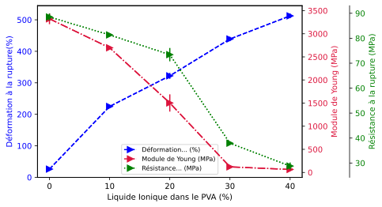

# 🧪 Polymer Tensile Properties Analysis

## 📌 Project Overview

This project analyzes experimental data to evaluate the effect of ionic liquid concentration on the mechanical properties of Polyvinyl Alcohol (PVA).

Using Python, experimental data stored in Excel is processed and visualized to compare three key mechanical properties:

- Elongation at break (%)
- Young's modulus (MPa)
- Tensile strength (MPa)

Error bars are included to represent the variability associated with the experimental measurements.

## 🛠️ Tools & Technologies

- **Python**
- **Pandas** — data import and manipulation
- **NumPy** — numerical computing
- **Matplotlib** — data visualization
- **Excel** — experimental data source

## 🔎 Analysis Workflow

1. Import experimental tensile data from Excel using Pandas.
2. Extract ionic liquid concentration and mechanical-property measurements.
3. Incorporate experimental error values for each mechanical property.
4. Create a multi-axis visualization to compare properties with different measurement scales.
5. Visualize how the mechanical behavior of PVA changes with ionic liquid concentration.

## 📊 Mechanical Properties Visualization

The visualization compares elongation at break, Young's modulus, and tensile strength across different ionic liquid concentrations.

The use of multiple Y-axes allows the three mechanical properties to be evaluated simultaneously despite their different units and scales.

## 💡 Skills Demonstrated

- Experimental Data Analysis
- Python for Data Analysis
- Pandas
- Data Import from Excel
- Data Visualization
- Matplotlib
- Multi-axis Visualization
- Error Bar Analysis
- Scientific Data Interpretation
- Chemical Engineering Applications

## 📁 Project Files

- `polymer_tensile_analysis.py` — Python script for data processing and visualization.
- `polymer_tensile_data.xlsx` — Experimental dataset used in the analysis.
- `polymer-tensile-properties.svg` — Final visualization of the mechanical properties.

## 👤 Author

**Juan Alejandro Bencosme Diaz**

Data Analyst | Power BI | Python | Chemical Engineering Background
